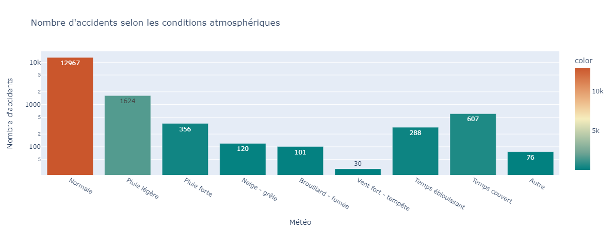
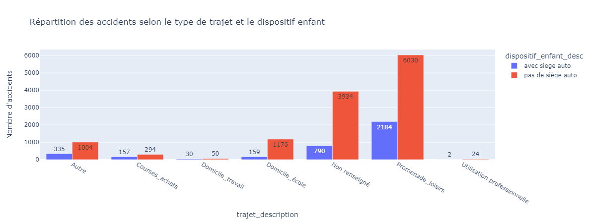
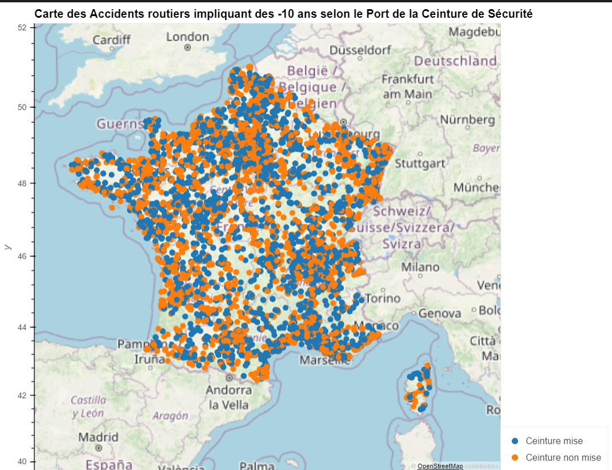

# Projet perso Accidents routiers de mineurs de moins de 10_ans  🚘
## Problématique : Transporter un enfant en voiture en France est-il dangereux ? 

La législation en France est claire, 
Toutes les personnes présentes dans le véhicule, qu’elles soient conductrice ou passagères, a fortiori LES ENFANTS doivent voyager correctement attachées.
Les enfants, en fonction de leur âge, sont maintenus soit dans un siège-auto (système homologué de retenue pour enfant), soit par une ceinture de sécurité.
Jusqu’à l’âge de **10 ans, chaque enfant doit obligatoirement voyager dans un siège auto adapté à son âge et à sa morphologie (sa taille et son poids)**. Ce siège doit être correctement installé dans le véhicule.

Selon le site [sécurité routière](https://www.securite-routiere.gouv.fr/reglementation-liee-lusager/reglementation-liee-aux-enfants/transporter-un-enfant-en-voiture#:~:text=Jusqu'%C3%A0%20l'%C3%A2ge%20de,correctement%20install%C3%A9%20dans%20le%20v%C3%A9hicule.&text=D%C3%A8s%20son%20plus%20jeune%20%C3%A2ge,habitude%20de%20toujours%20voyager%20attach%C3%A9).

Ayant remarqué lors de mes déplacements en voiture que la grande majorité des personnes ne sont pas au courant de cette règle. J'ai donc souhaité faire cette analyse pour sensibiliser sur les risques encourrus par les parents et proches lorsqu'ils n'attachent pas, ou transportent leurs enfants sans siège auto.

Analyse de la gravité des accidents mettant en cause les -10 ans en France
## A quelles proportions les -10 ans sont-il en danger sur les routes ? ⚡

- Trajet le plus accidentogène pour la tranche 0-10 ans
- Dispositif enfant utilisé ou non.
- L'utilisation de la ceinture est-elle généralisée?
- Prédiction de la gravité des accidents.

=================================
  Voici un aperçu des résultats obtenus :

  - ⛈️ Conditions météo favorables aux accidents ? 
    
  La plupart des accidents ont lieu quand les contitions météo sont normales. On ne peut donc pas accuser la pluie ou la neige.
 
  - 🚧 Les français suivent-ils la réglementation sur les sièges autos jusqu'a 10 ans ? 
 

  - 🚧 La ceinture est-elle mise sur tous les axes routiers ?  
    
